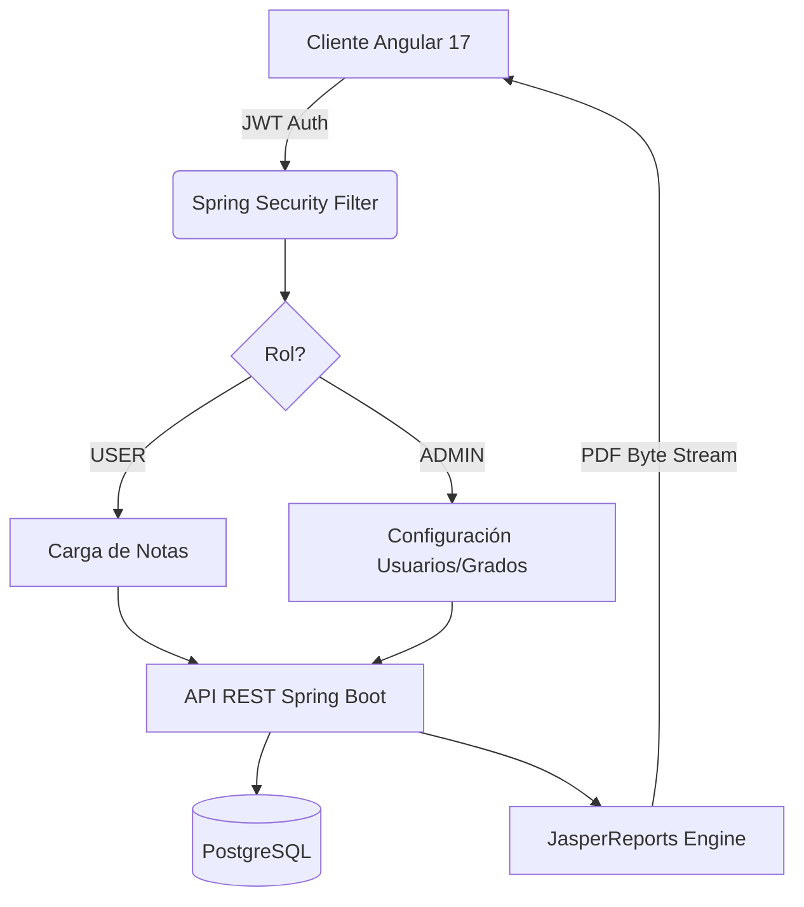

# 🎓 Sistema de Gestión de Calificaciones


Una aplicación web robusta y moderna diseñada para la administración académica, el registro de calificaciones y la generación de reportes oficiales. Construida con una arquitectura segura y escalable, enfocada en la experiencia de usuario y la integridad de los datos.

---

## 📋 Tabla de Contenidos
1. [Descripción General](#descripción-general)
2. [Características Principales](#características-principales)
3. [Arquitectura y Tecnologías](#arquitectura-y-tecnologías)
4. [Instalación y Configuración](#instalación-y-configuración)
5. [Seguridad](#seguridad)
6. [Roadmap](#roadmap)

---

## Descripción General

Este proyecto nace de la necesidad de modernizar la gestión escolar, pasando de procesos manuales a un sistema digital centralizado. Actualmente, el sistema permite:
* **Administradores:** Gestionar la estructura académica (materias, grados, usuarios).
* **Profesores:** Registrar notas, gestionar actividades y descargar boletines.

El sistema se encuentra en su **Fase 2**, ofreciendo un MVP (Producto Mínimo Viable) completamente funcional con seguridad basada en roles y generación de reportes PDF.

---

## Características Principales

###  Gestión Académica
* **CRUD Completo:** Gestión de Grados, Materias, Trimestres y Actividades.
* **Lógica de Notas (Upsert):** Sistema inteligente que detecta si una nota debe crearse o actualizarse, evitando duplicados.
* **Prevención de Errores:** Control de recursión infinita en relaciones bidireccionales JPA.

###  Frontend Moderno (Angular 17)
* **Standalone Components:** Arquitectura modular sin `AppModule`.
* **Signals & Control Flow:** Uso de la nueva sintaxis `@if`, `@for` para máximo rendimiento.
* **UX Reactiva:** Selectores en cascada (Grado -> Materia -> Actividad), *loading spinners* y validaciones visuales.

###  Reportes Avanzados
* **Motor JasperReports:** Generación de boletines oficiales en formato PDF "pixel-perfect".
* **Descarga de BLOBs:** Manejo de flujos binarios para descargas directas en el navegador sin pop-ups.
* **Cálculos Automáticos:** El backend procesa promedios aritméticos y agrupaciones antes de renderizar el reporte.

---

## Arquitectura y Tecnologías

### Stack Tecnológico

|Capa |	Tecnología	| Detalles|
|:------------|:-----------------|:----------------------|
|Base de Datos|	PostgreSQL	|Modelo relacional normalizado.|
|Backend	|Spring Boot 3 (Java 17)	|API RESTful, JPA, Hibernate.|
|Seguridad	|JWT (Stateless)	|Inyección de Roles (Claims), Filtros |personalizados.|
|Frontend	|Angular 17+	|Standalone, Bootstrap 5, RxJS.|
|Reportes	|JasperReports 6.20	|Diseño .jrxml y exportación PDF.|

### Diagrama de Flujo Simplificado


---

## Instalación y Configuración
Prerrequisitos
Java JDK 17+

Node.js (v18+) & Angular CLI

PostgreSQL

1. Backend (Spring Boot)
Clonar el repositorio.

Configurar `src/main/resources/application.properties` con tus credenciales de BD:

`Properties`

```
spring.datasource.url=jdbc:postgresql://localhost:5432/tu_base_de_datos
spring.datasource.username=tu_usuario
spring.datasource.password=tu_contraseña
````
Ejecutar el proyecto:


`Bash`

```./mvnw spring-boot:run```
2. Frontend (Angular)
Navegar a la carpeta del cliente.

Instalar dependencias:

`Bash`
`npm install`

Iniciar el servidor de desarrollo:

`Bash`
`ng serve`
Acceder a `http://localhost:4200.`

## Seguridad
El sistema implementa una estrategia de seguridad robusta:

JWT (JSON Web Tokens): Autenticación stateless.

Role-Based Access Control (RBAC):

El token incluye Claims con el rol del usuario.

Backend: `SecurityFilterChain` protege endpoints críticos.

Frontend: `Guards` y decodificación de token (`jwt-decode`) para proteger rutas y adaptar el menú de navegación.

CORS: Configurado para permitir verbos GET, POST, PUT, DELETE, OPTIONS desde el cliente Angular.

---

## Roadmap
El desarrollo continúa hacia la independencia de conexión y uso de escritorio.

[ ] Empaquetado Desktop: Integración con Electron.js para generar ejecutable .exe.

[ ] Base de Datos Local: Implementación de SQLite para almacenamiento local.

[ ] Sincronización: Mecanismo de sincronización Offline-First (Local -> Nube).

[ ] Edición Masiva: Tabla tipo Excel para carga rápida de notas por lote.

# Autor: Gabriel Ernesto Diaz Galdamez
